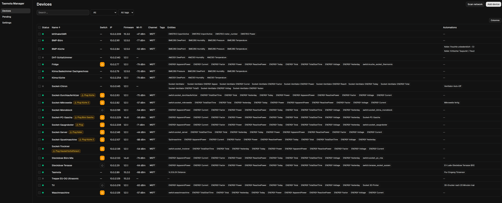
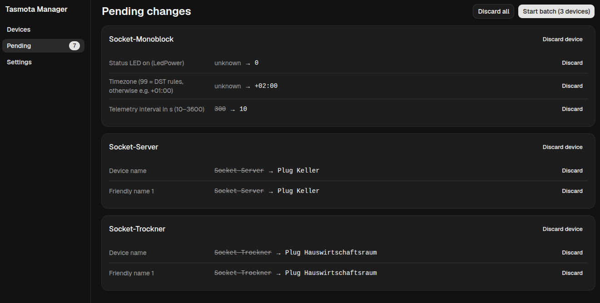
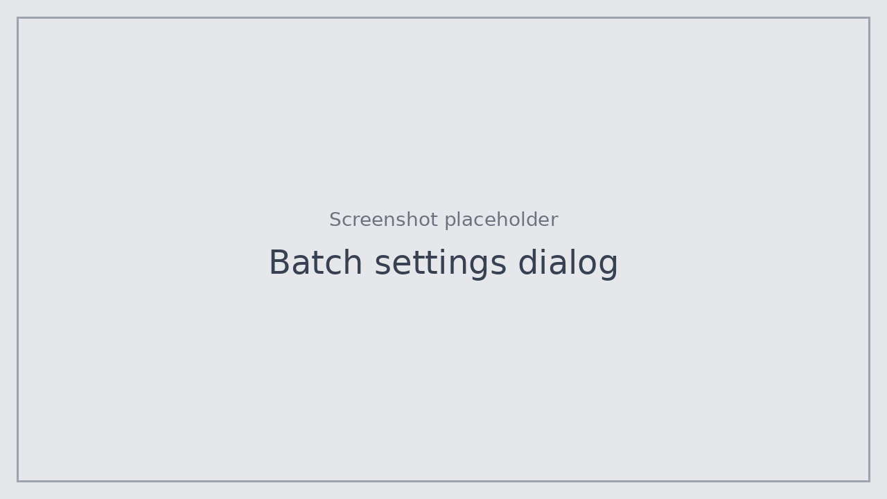
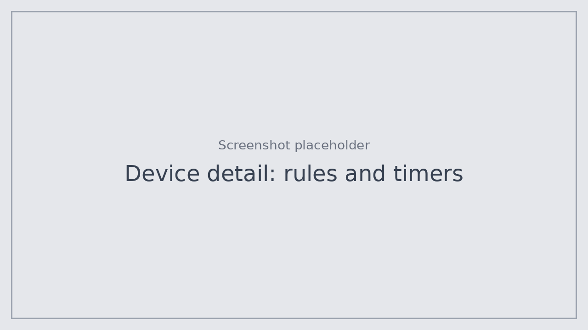

# Tasmota Manager for Home Assistant

A Home Assistant app (add-on) that manages all Tasmota devices on your network from the sidebar: find them, see their state, and change settings on many devices in one controlled batch run.

[](https://my.home-assistant.io/redirect/supervisor_add_addon_repository/?repository_url=https%3A%2F%2Fgithub.com%2FBlogshot%2Ftasmota-manager)

> **Early software.** Bugs are likely, including ones that lock a device out of Home Assistant (for example through wrong MQTT settings) or overwrite rules and timers. There is no backup function yet. Back up a device's configuration in its own web UI before you change it, and start with one or two devices you can easily recover.



## Features

- **Device discovery** via MQTT (Tasmota discovery) and via HTTP network scan. MQTT is optional; without a broker the app works over HTTP only.
- **Device overview** with status, firmware, signal strength, tags and filtering.
- **Switch column:** devices with relays or lights show one button per output with its current state. A click toggles it right away.
- **Staged changes:** apart from toggling, nothing is written to a device when you click. Every configuration change goes into a pending list first and is only written when you start the batch run.
- **Batch configuration:** select several devices and set common settings in one go, such as PowerOnState, LED behaviour, sleep, MQTT, syslog, timezone and location.
- **Free commands** for several devices at once, with placeholders such as `{{name}}` or `{{mac6}}`.
- **Rules and timers editor**, per device or for a selection.
- **Safe batch runs:** settings that trigger a restart are bundled per device and sent last. The app waits for the device to come back, reads every value back and verifies it. Failed changes stay in the list with their error and can be retried.
- **Name suggestions:** devices that are still called "Tasmota" get a suggested name based on their sensors and their Home Assistant area.
- **Home Assistant links:** each device links to its device page and related automations. Diagnostic and configuration entities are left out to keep the table readable.
- **Six languages:** English, German, French, Spanish, Italian and Dutch. By default the app follows your Home Assistant profile language and falls back to English.
- **Passwords:** one global web password plus per-device overrides.
- **Console** per device for quick commands and queries.
- Runs through **ingress** only; the port is not reachable directly from the network.

## Screenshots

The images below are placeholders and will be replaced with real screenshots.

| Pending changes | Batch settings |
| --- | --- |
|  |  |



## Installation

Click the button above, or add the repository by hand:

1. In Home Assistant open **Settings → Apps → App store → ⋮ → Repositories**.
2. Add `https://github.com/Blogshot/tasmota-manager`.
3. Install **Tasmota Manager** and open it from the sidebar.

Supported architectures are amd64 and aarch64. The image is built locally on install, which takes a few minutes.

## How it works

1. **Find devices.** With an MQTT service configured in Home Assistant the app connects on its own and devices show up through Tasmota discovery. Use **Scan network** for devices without MQTT.
2. **Stage changes.** Select devices and use **Edit** for settings, commands, rules or timers. Changes appear under **Pending** with the old and the new value.
3. **Start the batch.** The app writes the changes device by device, waits for restarts and verifies each value.

The full user documentation is in [tasmota_manager/DOCS.md](tasmota_manager/DOCS.md) (German) and is also shown in the app's documentation tab.

## Current limitations

- The French, Spanish, Italian and Dutch translations are machine-made and not reviewed by native speakers.
- Firmware updates (OTA) and configuration backups are planned but not included yet.
- Tested on the maintainer's own devices only (22 devices, firmware 12.1 to 15.3, rough testing).

## A note on AI use

Most of the code was written with an AI coding assistant (Claude Code). The maintainer made the design decisions, reviewed the results and runs the app on their own devices. There is an automated test suite, and the AI-written code was reviewed step by step.

## Development

```bash
cd tasmota_manager
pnpm install
pnpm test
pnpm dev:server   # API on :8099, data in tasmota_manager/.data
pnpm dev:web      # Vite on :5173, proxies /api to :8099
```

The repository is a Home Assistant app repository; the monorepo lives in `tasmota_manager/` (packages `shared`, `server`, `web`). CI runs typecheck, tests and an image build on every push.
